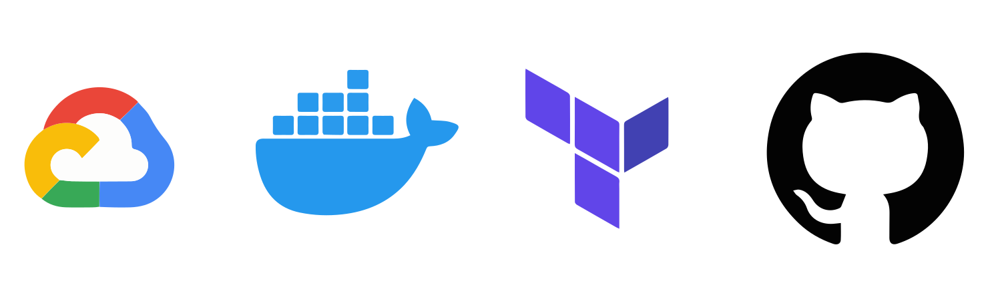

[](https://github.com/gerardmargaux/summarize_text/actions)
[](https://github.com/gerardmargaux/summarize_text/actions)


[](https://www.python.org/downloads/release/python-380/)
[](https://www.terraform.io)
[](https://opensource.org/licenses/MIT)

# Deploying a Flask API to Google Cloud Run using Terraform and GitHub Actions

The goal of this personal project is to deploy a Dockerized Flask API to Google Cloud Run, while provisioning the required infrastructure with Terraform. It is advised to use an Infrastructure-as-Code (IaC) solution to provision your infrastructure while deploying an API to the cloud. IaC has several benefits over manually setting your cloud environment, including easy reproducibility and the ability to maintain consistency across various staging environments.

<p align="center">
  </a>
</p>

## 🛠️ What are the pre-requisites?

In order to be able to deploy you Flask API using this repository, you need the following pre-requisites:

### **Google Cloud Plateform (GCP)**

After creating a GCP account (if you do not already have one), you can manually create a new GCP project with a service account having the following roles: 
- Editor
- Artifact Registry Administrator
- Cloud Run Admin
- Project IAM Admin
- Service Usage Admin

### **Github**

You need a Github account in order to:
- Clone this repository
- Store your secret keys
- Use Github Actions for the CI/CD deployment

## 🚀 How to deploy your Flask API?

In order to deploy your Flask API to the cloud, here are the steps that you need to follow:

### **1. Build your Flask application**

Obviously, the first step is to create your web application. In this project, we have decided to use [Flask](https://flask.palletsprojects.com/en/2.2.x/) but you are free to choose the web framework that you prefer. 

For this project, we decided to create a simple web application that uses a [Hugging Face](https://huggingface.co) model to summarise a very long text in a few seconds. This application can be very useful if you want to retrieve the important information from an article but don't have the time to read it all. 

Most of the time, a particular folder is created to store the files used to build the web application. Here, we have stored the Flask application in the *app* folder. When your Flask app is implemented, you can launch it locally using the following command: 
```
$ flask run
```

---
**NOTE**

This is a development server, you cannot use it in a production deployment. In production, a WSGI server should be used instead.

---

You can run the Flask application using Gunicorn as your WSGI server with the following command:
```
$ gunicorn app.main:app -b 0.0.0.0:5000
```

### **2. Dockerize the Flask app**

Now that our web application is built, we need to find a way to package it before deploying it to the cloud. You can use [Docker](https://www.docker.com/) to pack your application with everything you need to run the application (such as libraries) and ship it as one package called container. The following command can be used to build your Docker image: 
```
docker build . -t <image_tag>
```

When you Docker image is built, you can run the image locally using the following command: 
```
docker run -p 5000:5000 <image_tag>
```

### **3. Configure Cloud Storage bucket to store Terraform state**
By default, Terraform saves the state locally in a `terraform.tfstate` file. However, if we want to provision our infrastructure through CI/CD we should use a backend for Terraform, so our state is stored remotely in a Cloud Storage bucket. A useful tutorial for creating this can be found [here](https://cloud.google.com/docs/terraform/resource-management/store-state).

### **4. Build the cloud infrastructure using Terraform**
In this project, the Cloud infrastructure is stored in the *infra/main* folder. All files present in this folder contain Terraform code in order to maintain the following Cloud infrastructures:
- Enable API's of features we need like Cloud Run or Artifact registry
- Save the current Terraform state to the remove Cloud Storage bucket
- Create a service account for pushing the Docker image to Artifact Registry
- Deploy the Docker image to an endpoint

### **5. Deploy using Github Actions (CI/CD)**
This project is currently using Github Actions for the CI/CD so that the code is deployed on production when you do a pull request or a push to the `main` branch.

---
**NOTE**

A direct push to the main branch should be avoided. Indeed, when you want to add an element to your code, you must create a branch and create a pull request to the main branch.

---

When you push a new version of the code on the `main` branch, one workflow containing the following steps will be created:
- **Build Docker image**: This step will trigger the build of a new Docker image containing the code that was just pushed. This image will then be push to the Artifact Registry on GCP. 
- **Infrastructure for Terraform**: This step will maintain the Cloud infrastructure using Terraform and will also trigger the deployment of the Docker image previously built to an endpoint. 

After the deployment on production, you will be able to access your Flask API in your Web browser using a public url. 

## 🔑 What secret keys are required? 

In order to deploy using Github actions, we need to store the credentials of the service accounts that we created previously in a safe location. Those can be stored in Github secrets related to your project. 

| Name | Description | Type | Required |
|------|-------------|------|:--------:|
| GCP_DOCKER_PUSHER_AUTH | Access key of the Docker pusher service account | `json` | yes |
| GCP_SERVICE_ACCOUNT_AUTH  | Access key of the infrastructure service account | `json` | yes |


